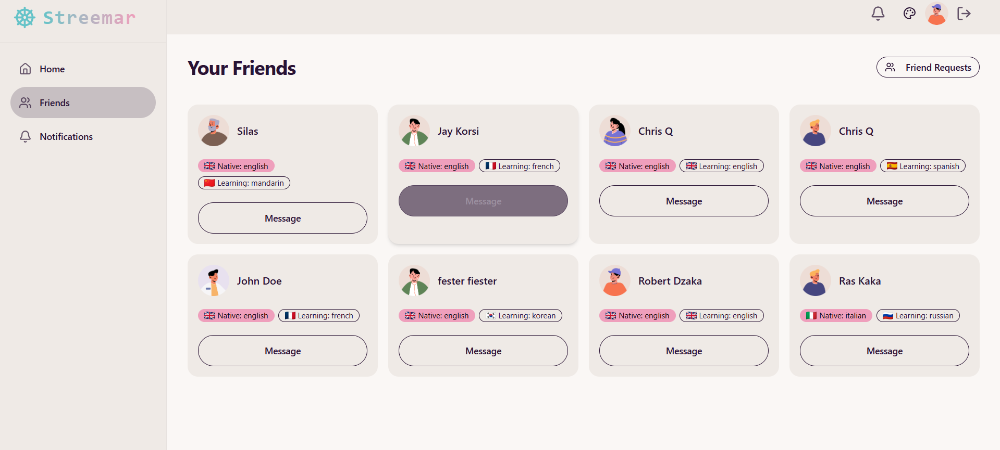
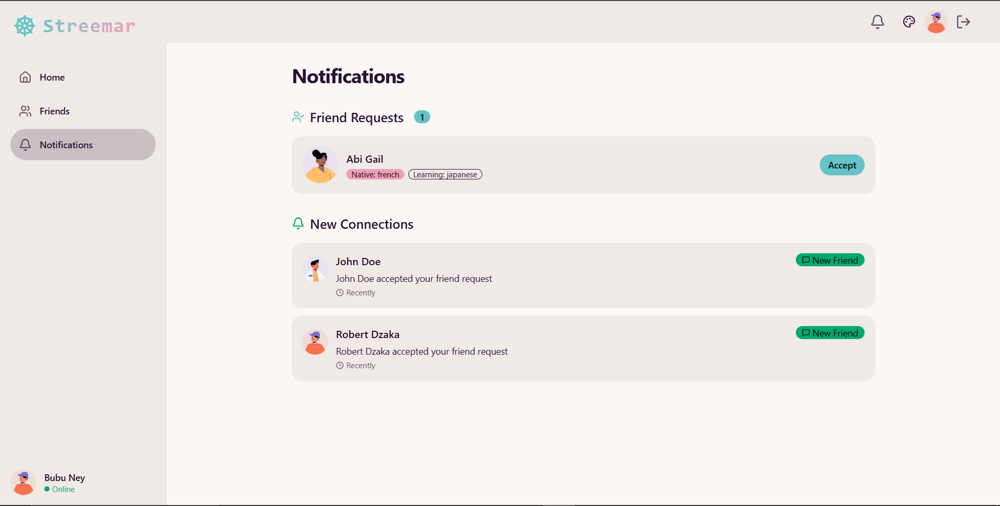
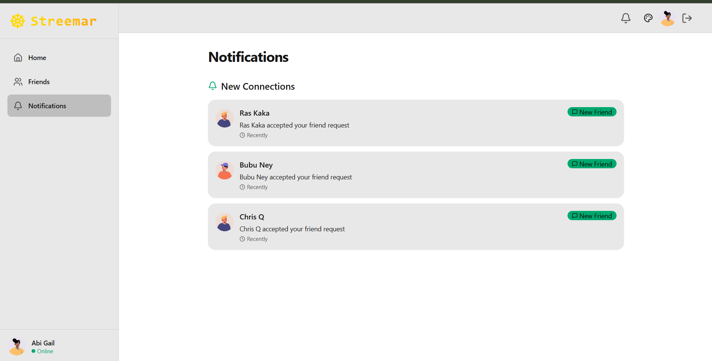
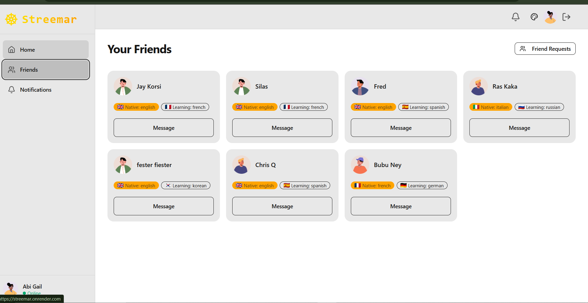
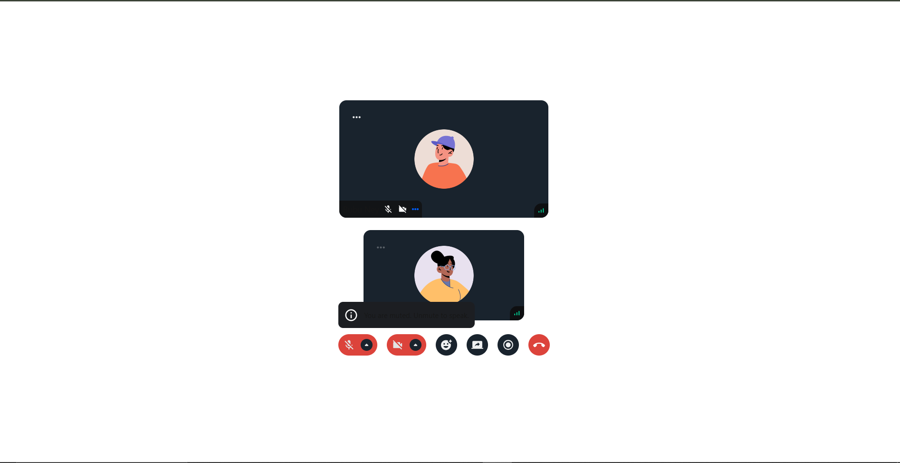

# streemar
# ✨ Fullstack Chat & Video Calling App ✨
This is a fully fledged chat and video call application

> Highlights: this project integrates

- 🌐 Real-time Messaging with Typing Indicators & Reactions
- 📹 1-on-1 and Group Video Calls with Screen Sharing & Recording
- 🔐 JWT Authentication & Protected Routes
- 🌍 Language Exchange Platform with 32 Unique UI Themes
- ⚡ Tech Stack: React + Express + MongoDB + TailwindCSS + TanStack Query
- 🧠 Global State Management with Zustand
- 🚨 Error Handling (Frontend & Backend)
- 🚀 Free Deployment
- 🎯 Built with Scalable Technologies like Stream
- ⏳ And much more!

# 
# 
# 
# 
# 

